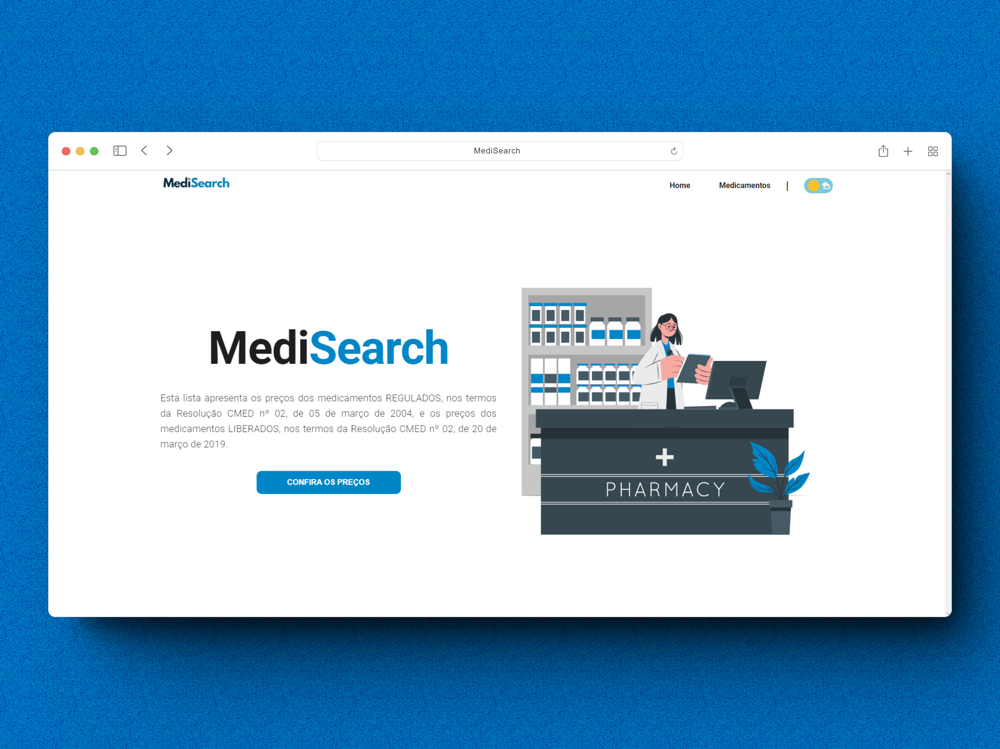

<div align="center">

<p>
MediSearch is a web application that enables users to search for medication prices listed by ANVISA, the Brazilian Health Regulatory Agency. This application is built using the Vue.js framework for the frontend and Django for the backend</p>
</div>




## Technologies Used
- [Vue.js](https://vuejs.org/)
- [Vuetify](https://vuetifyjs.com/en/)


## Usage <a name = "usage"></a>
To run the project, you need to have Docker and Docker Compose installed on your local machine. Once you have these installed, you can run the following commands to start the project:

```bash

$  mkdir MediSearch

$ cd MediSearch

$ git clone https://github.com/Eliezir/MediSearch-backEnd

$ git clone https://github.com/Eliezir/MediSearch-frontEnd

```
create a docker-compose.yml file in the root of the project and add the following content:

```bash

include:
  "./frontend/docker-compose.yml"
  "./backend/docker-compose.yml"

```

 Then go to your backend folder, and in your docker-compose.yml file, add your database credentials in the environment section of the db service. Then, go to your database and import the csv file in the data folder. Then run the following command to start the project:

```bash

$ docker-compose up -d --build

```

<sub>Made with 💜 by <a href="https://github.com/Eliezir">Eliezir Neto</a> </sub>
